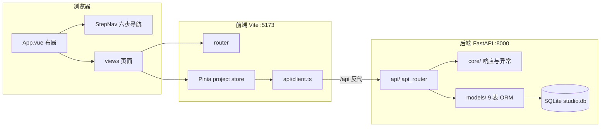

# 系统架构

## 概述

AI 漫剧制作工作台是一个前后端分离的 Web 应用，将"AI 漫剧制作六步流程"（剧本、分镜、定妆、生图、音频、剪辑）产品化为浏览器中的可视化工作台。创作者在一个应用中完成从剧本创意到 1080×1920 竖屏成片的完整生产，各 AI 环节由用户自行配置模型服务（OpenAI 兼容协议为主），平台不内置密钥。

系统定位为本地优先的单用户工作台：SQLite 存储元数据，本地文件系统存储图片/音频/视频素材，FFmpeg 完成视频合成。当前处于 Phase 0 脚手架阶段，六步业务模块（剧本/分镜/定妆/生图/音频/合成）的后端 API 与前端页面均为框架占位，后续阶段逐步填充。

## 技术栈

**语言与运行时**
- Python 3.11
- TypeScript 5.6
- Node.js 22

**框架**
- FastAPI 0.115（后端 Web 框架）
- SQLAlchemy 2.0（ORM）
- Alembic 1.14（数据库迁移）
- Vue 3.5 + Vite 6（前端）
- Pinia 2.3（前端状态管理）
- Vue Router 4.5（前端路由）

**数据存储**
- SQLite（元数据，`backend/media/studio.db`）
- 本地文件系统（素材，`backend/media/{project_id}/`）

**外部服务**
- 用户自配 AI 模型服务（文本生成 / 图像生成 / 语音合成，Phase 1 起接入）
- FFmpeg（视频合成引擎，Phase 7 起使用）

## 项目结构

```
workspace/
├── backend/                  # FastAPI 后端
│   ├── app/
│   │   ├── main.py           # 应用入口，创建 FastAPI 实例
│   │   ├── config.py         # pydantic-settings 配置管理
│   │   ├── database.py       # SQLAlchemy 引擎/会话/Base
│   │   ├── api/              # 路由层（当前仅 health）
│   │   ├── core/             # 统一响应、异常处理、素材目录工具
│   │   ├── models/           # 9 张表的 ORM 模型
│   │   ├── schemas/          # Pydantic 模型（Phase 1 起填充）
│   │   └── providers/        # AI Provider 适配层（Phase 1 起填充）
│   ├── alembic/              # 数据库迁移脚本
│   ├── media/                # 素材根目录
│   ├── tests/                # pytest 测试
│   └── alembic.ini
└── frontend/                 # Vue3 + Vite 前端
    └── src/
        ├── main.ts           # 前端入口
        ├── App.vue           # 布局（顶栏 + 六步侧边导航）
        ├── api/              # 统一 API 客户端
        ├── router/           # 路由定义
        ├── stores/           # Pinia 状态（项目）
        ├── views/            # 页面（项目列表 + 六步 + 模型配置）
        └── components/       # 通用组件（步骤导航、占位页）
```

**入口点**
- `backend/app/main.py` - `create_app()` 构建 FastAPI 应用
- `frontend/src/main.ts` - 挂载 Vue 应用，注册 Pinia 与 Router

## 子系统

### 后端 API 层
**目的**: 暴露 HTTP 端点，当前提供健康检查；后续承载六步业务模块路由
**位置**: `backend/app/api/`
**关键文件**: `api/__init__.py`（api_router 聚合）、`api/routes/health.py`
**依赖**: core、models、database
**被依赖**: 前端通过 `/api` 反代调用

### 统一响应与错误处理
**目的**: 所有响应统一为 `{code, message, data}` 格式，异常转换为该格式
**位置**: `backend/app/core/`
**关键文件**: `core/response.py`、`core/errors.py`
**依赖**: fastapi/starlette 异常体系
**被依赖**: 全局（异常处理器在 `main.py` 注册）

### ORM 数据模型层
**目的**: 定义 9 张业务表的映射：projects、scripts、storyboards、characters、scenes、shot_assets、audio_assets、exports、model_configs
**位置**: `backend/app/models/`
**关键文件**: `models/__init__.py`（聚合导出）
**依赖**: database.Base
**被依赖**: 后续业务模块、Alembic 迁移

### 素材目录管理
**目的**: 按项目创建 `characters|shots|audio|exports` 子目录
**位置**: `backend/app/core/storage.py`
**被依赖**: Phase 2 起项目创建时调用

### 前端工作台
**目的**: 顶栏 + 六步侧边导航 + 页面路由的壳；项目列表页已有创建表单骨架
**位置**: `frontend/src/`
**关键文件**: `App.vue`、`router/index.ts`、`stores/project.ts`、`api/client.ts`
**依赖**: `/api` 反向代理到后端 8000 端口

## 图表


