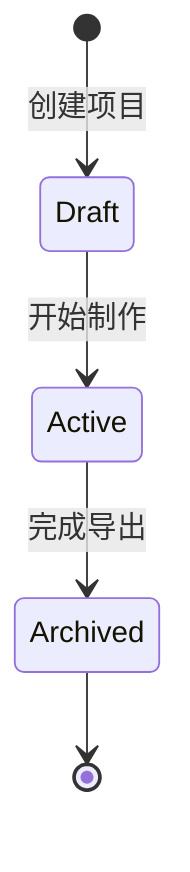

# 项目

项目（Project）是一次 AI 漫剧制作任务的完整载体，聚合剧本、分镜、角色、场景、素材与成片。

## 什么是项目？

项目对应 `projects` 表，是六步流程所有数据的根。每个项目包含：剧本（scripts）、分镜（storyboards）、角色（characters）、场景（scenes）、音频（audio_assets）、成片（exports），以及本项目的素材目录 `backend/media/{id}/`。

**关键特征**:
- 唯一身份：自增 `id`，前端路由 `projects/:id/...` 按项目组织六步页面
- 状态：`status` 字段（默认 `draft`）
- 素材目录：由 `core/storage.py` 的 `ensure_project_media()` 在创建时建立 `characters|shots|audio|exports` 子目录

## 代码位置

| 方面 | 位置 |
|------|------|
| 模型 | `backend/app/models/project.py` |
| 素材目录 | `backend/app/core/storage.py` |
| 前端状态 | `frontend/src/stores/project.ts`（store 已含项目列表/创建骨架，API 端点 Phase 2 实现） |

## 不变量

1. **唯一性**: `projects.id` 全局唯一，其他业务表通过 `project_id` 归属项目
2. **素材隔离**: 素材文件按 `media/{project_id}/` 隔离，不跨项目共享
3. **外键约束**: scripts/storyboards/characters/scenes/audio_assets/exports 的 `project_id` 必须存在

## 生命周期

