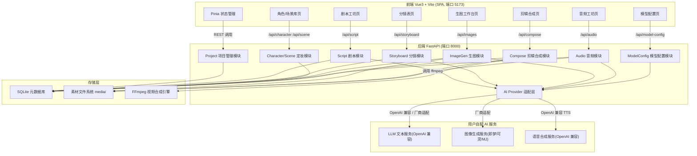

# AI 漫剧制作工作台

Feature Name: ai-comic-drama-studio
Updated: 2026-08-11

## Description

AI 漫剧制作工作台将"AI 漫剧制作六步流程"产品化为一个前后端分离的 Web 工作台应用。创作者在浏览器中完成：剧本创作 → 分镜拆解 → 角色与场景定妆 → 批量生图 → 配音配乐 → 剪辑合成，最终导出 1080×1920 竖屏 MP4 成片。各 AI 环节由用户自行配置模型服务（OpenAI 兼容协议 + 即梦/可灵等厂商适配），平台本身不内置任何密钥。

产品定位为本地优先的单用户工作台，数据与素材全部存储在本机，便于单人创作者低成本使用。

## Architecture



### 架构说明

- **前后端分离**：前端 Vite 开发服务器通过 `/api` 反向代理到 FastAPI 后端，规避 CORS 并保证预览环境单端口可访问。
- **适配层解耦**：所有 AI 能力经 `AI Provider` 适配层统一暴露 `TextProvider` / `ImageProvider` / `TTSProvider` 三个抽象接口，业务模块不感知具体厂商差异。
- **本地优先存储**：元数据入 SQLite，图片/音频/视频等大文件入 `media/` 目录，路径以相对地址入库，项目可整体迁移。
- **视频合成引擎**：使用 FFmpeg 命令行完成图片序列 + 音频混流 + 字幕烧录 + 推拉运镜（zoompan filter），避免引入重型桌面剪辑依赖。

## Components and Interfaces

### 后端 API（FastAPI，前缀 `/api`）

| 模块 | 端点 | 职责 |
|------|------|------|
| Project | `POST /projects` `GET /projects` `GET/PUT /projects/{id}` | 项目生命周期管理 |
| Script | `POST /projects/{id}/script/generate` `PUT /projects/{id}/script` | LLM 生成初稿、节奏分段、抽取角色/场景、改写 |
| Storyboard | `POST /projects/{id}/storyboard/generate` `GET/PUT /projects/{id}/storyboard` | 剧本拆解分镜、镜头拆分/排序、过渡分镜提示 |
| Character | `POST /projects/{id}/characters` `POST /projects/{id}/characters/{cid}/portrait` | 角色形象登记、定妆照生成 |
| Scene | `POST /projects/{id}/scenes` | 场景描述词登记 |
| ImageGen | `POST /projects/{id}/images/generate` `GET/PUT /projects/{id}/images/{sid}` | 按分镜生图、候选择优、风格校验 |
| Audio | `POST /projects/{id}/audio/voice` `POST /projects/{id}/audio/bgm` `POST /projects/{id}/audio/sfx` | 逐句配音、背景音乐、音效对齐 |
| Compose | `POST /projects/{id}/compose/preview` `POST /projects/{id}/compose/export` | 合成预览、导出成片 |
| ModelConfig | `GET/PUT /model-config` `POST /model-config/test` | 三类能力模型配置与连通性校验 |

### AI Provider 适配层接口

```python
class TextProvider(Protocol):
    def generate(self, prompt: str, system: str, **kw) -> str: ...
    def rewrite(self, text: str, instruction: str) -> str: ...

class ImageProvider(Protocol):
    def generate(self, prompt: str, ref_images: list[Path] | None = None, **kw) -> list[Path]: ...

class TTSProvider(Protocol):
    def synthesize(self, text: str, emotion: str, voice: str | None = None) -> Path: ...
```

实现类按用户配置的 `provider_type` 注册：`openai_compatible`（LLM/TTS 通用）、`jimeng`、`keling`、`midjourney`。图像生成的垫图能力依赖厂商是否支持参考图，适配层对不支持的厂商降级为仅传描述词并在响应中标注。

### 前端页面与路由

| 路由 | 组件 | 对应流程 |
|------|------|----------|
| `/projects` | 项目列表页 | - |
| `/projects/:id/script` | 剧本工坊 | 第一步 |
| `/projects/:id/storyboard` | 分镜表 | 第二步 |
| `/projects/:id/casting` | 角色场景库 | 第三步 |
| `/projects/:id/gallery` | 生图工作台 | 第四步 |
| `/projects/:id/audio` | 音频工坊 | 第五步 |
| `/projects/:id/studio` | 剪辑合成 | 第六步 |
| `/settings/models` | 模型配置 | 全局 |

## Data Models

### 元数据（SQLite 表）

```sql
-- 项目
CREATE TABLE projects (
  id INTEGER PRIMARY KEY,
  title TEXT NOT NULL,
  genre TEXT,                 -- 题材类型
  status TEXT DEFAULT 'draft',
  created_at TEXT NOT NULL,
  updated_at TEXT NOT NULL
);

-- 剧本
CREATE TABLE scripts (
  id INTEGER PRIMARY KEY,
  project_id INTEGER NOT NULL REFERENCES projects(id),
  content TEXT NOT NULL,      -- 200-300 字初稿
  beats TEXT NOT NULL,        -- JSON 数组，节奏分段 [{"time":"0-15s","point":"钩子"}]
  structure TEXT NOT NULL,    -- JSON {opening, conflict, ending}
  created_at TEXT NOT NULL
);

-- 分镜表
CREATE TABLE storyboards (
  id INTEGER PRIMARY KEY,
  project_id INTEGER NOT NULL REFERENCES projects(id),
  shot_no INTEGER NOT NULL,
  scene_desc TEXT NOT NULL,     -- 画面描述
  shot_type TEXT NOT NULL,      -- 特写/中景/远景
  camera_angle TEXT,            -- 平视/俯拍/仰拍
  dialogue TEXT,
  emotion TEXT,
  duration REAL DEFAULT 1.8,    -- 秒，默认 1.5-2
  image_id INTEGER,             -- 关联选定的正式素材
  created_at TEXT NOT NULL
);

-- 角色
CREATE TABLE characters (
  id INTEGER PRIMARY KEY,
  project_id INTEGER NOT NULL REFERENCES projects(id),
  name TEXT NOT NULL,
  keywords TEXT NOT NULL,       -- 固定角色关键词组
  portrait_path TEXT,           -- 定妆照路径
  created_at TEXT NOT NULL
);

-- 场景
CREATE TABLE scenes (
  id INTEGER PRIMARY KEY,
  project_id INTEGER NOT NULL REFERENCES projects(id),
  name TEXT NOT NULL,
  desc_words TEXT NOT NULL,     -- 统一场景描述词
  created_at TEXT NOT NULL
);

-- 镜头候选素材
CREATE TABLE shot_assets (
  id INTEGER PRIMARY KEY,
  storyboard_id INTEGER NOT NULL REFERENCES storyboards(id),
  file_path TEXT NOT NULL,
  is_selected INTEGER DEFAULT 0, -- 该镜头正式选图
  style_score REAL,             -- 风格一致性评分
  created_at TEXT NOT NULL
);

-- 音频素材
CREATE TABLE audio_assets (
  id INTEGER PRIMARY KEY,
  project_id INTEGER NOT NULL REFERENCES projects(id),
  kind TEXT NOT NULL,           -- voice/bgm/sfx
  storyboard_id INTEGER,        -- 配音关联镜头
  file_path TEXT NOT NULL,
  emotion TEXT,
  volume REAL DEFAULT 1.0,
  align_shot INTEGER,           -- 音效对齐的镜头号
  created_at TEXT NOT NULL
);

-- 成片记录
CREATE TABLE exports (
  id INTEGER PRIMARY KEY,
  project_id INTEGER NOT NULL REFERENCES projects(id),
  file_path TEXT NOT NULL,
  resolution TEXT DEFAULT '1080x1920',
  duration REAL,
  created_at TEXT NOT NULL
);

-- 模型配置（三类能力）
CREATE TABLE model_configs (
  id INTEGER PRIMARY KEY,
  capability TEXT NOT NULL UNIQUE, -- text/image/tts
  provider_type TEXT NOT NULL,     -- openai_compatible/jimeng/keling/midjourney
  base_url TEXT NOT NULL,
  api_key_enc TEXT NOT NULL,       -- 加密存储
  model_name TEXT NOT NULL,
  is_valid INTEGER DEFAULT 0,      -- 连通性校验通过
  updated_at TEXT NOT NULL
);
```

### 素材文件组织

```
media/
└── {project_id}/
    ├── characters/    # 定妆照
    ├── shots/         # 分镜候选图与选图
    ├── audio/         # voice/bgm/sfx
    └── exports/       # 合成成片
```

### 关键技术决策

- **API Key 加密**：使用本机派生密钥（环境变量 + 机器特征）以 Fernet 对称加密写入 `model_configs.api_key_enc`，导出/备份项目时剔除密钥字段。
- **分镜数据版本化**：分镜表以"行可重排"设计，`shot_no` 仅作展示序，界面调整时由后端一次性重排并落库。
- **风格一致性评分**：生图候选返回后，用 CLIP 或图像嵌入相似度计算候选图与定妆照的余弦相似度，作为 `style_score` 辅助用户择优。

## Correctness Properties

1. **形象一致性**：同一角色任意两次生图请求必须携带同一组 `keywords` 与定妆照；未配置定妆照的角色不得进入生图流程。
2. **剧本结构完整性**：剧本入库时必须同时满足字数区间（200-300 字）与三段结构（开头/冲突/结尾）非空校验；不满足时后端拒绝并返回结构提示。
3. **分镜覆盖性**：分镜表生成后，台词覆盖校验必须通过——剧本中每句台词至少映射到一个镜头，无遗漏、无重复引用。
4. **镜头时长约束**：单镜头 `duration` 取值域为 {0.5, 1.5, 2.0} 秒，合成引擎对越界值拒绝合成并提示。
5. **音频电平约束**：BGM 相对人声的增益默认 -12dB（约人声 25%），合成时若检测到人声轨缺失，SHALL 拒绝启用 BGM 或自动将 BGM 降为 -18dB 背景层。
6. **导出规范**：所有成片必须是 1080×1920、H.264、含音轨的 MP4；FFmpeg 合成返回非零码时视为导出失败，不产生残留半成品文件。

## Error Handling

| 场景 | 处理策略 | 用户可见反馈 |
|------|----------|--------------|
| AI 模型调用失败/超时 | 适配层捕获异常，按 provider 重试 1 次后抛出 | "模型调用失败"卡片，附可复制错误码，可一键切换模型重试 |
| 模型配置无效 | 配置保存时同步触发连通性测试 | 配置项标记"未通过校验"，禁止该能力发起任务 |
| 生图出现角色形变 | 响应侧提示建议（调整描述词/换角度） | 弹窗提示 + 一键带入新描述词重新生成 |
| 分镜拆解失败（文本超长等） | 截断至 300 字并提示 | "剧本超长已自动截断"警示条 |
| 素材文件缺失 | 合成前全量校验素材存在性 | 定位缺失镜头列表，阻止合成 |
| FFmpeg 不可用/导出失败 | 引擎启动时自检；失败清理临时文件 | "合成失败" + 日志路径 |
| 音画不同步 | 导出前预览检测音轨时长与镜头总时长偏差 | 预览页偏差提示，建议微调镜头时长 |

## Test Strategy

### 单元测试（pytest）

- **剧本模块**：结构校验、字数边界、节奏分段解析。
- **分镜模块**：动作拆分逻辑（摔杯三连）、景别轮换规则、台词覆盖校验、镜头重排。
- **适配层**：mock 各 provider 的请求/响应契约；对不支持垫图的厂商做降级断言。
- **配置模块**：Key 加密往返、导出脱敏、连通性测试 mock。

### 集成测试

- 前端 → 后端 → 本地 FFmpeg 的端到端合成：3 张测试图 + 2 句 TTS 音频 → 导出 MP4 并断言分辨率、时长、码率。
- 生图流程：mock 图像服务返回固定尺寸 PNG，验证候选图入库与选图切换。

### 契约测试

- 前端调用后端 API 的类型契约（OpenAPI schema 快照），防止前后端字段漂移。

### 人工验收

- 六步流程全链路走查：真实剧本 → 分镜 → 定妆 → 生图 → 配音 → 合成导出，对照本 spec 的 R1-R9 验收标准逐条勾验。
- 手机端导出视频回放检查画面协调性与音画同步。
